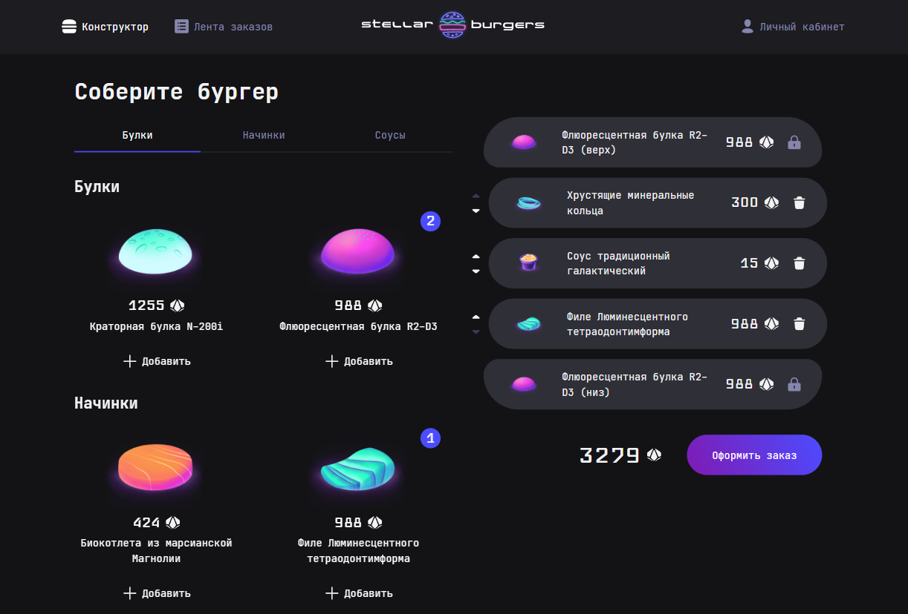

# Конструктор бургеров «Stellar Burgers»

«Stellar Burgers» - это веб-приложение для создания космических бургеров, где пользователи могут собирать рецепты из списка ингредиентов, оформлять заказы и просматривать историю своих покупок. Проект включает в себя функциональность динамического конструктора бургеров, ленту заказов, авторизацию пользователей, редактирование профиля и страницы для регистрации/восстановления пароля.

Проект разработан с целью углубленного изучения React, включая управление глобальным состоянием с Redux - обработку событий, создание слайсов, экшенов и редюсеров. В рамках проекта реализована маршрутизация с использованием React Router, авторизация и защищенные роуты, а также тестирование с использованием Jest для юнит-тестов и Cypress для интеграционных тестов, охватывающих пользовательские сценарии.

[Макет в Figma](https://www.figma.com/design/vIywAvqfkOIRWGOkfOnReY/)



## Функционал приложения

- Конструктор бургеров: отображение доступных ингредиентов, добавление/удаление ингредиентов в бургер с динамическим расчетом стоимости.
- Управление булками: ограничение выбора одним типом булки, отображаемой сверху и снизу бургера.
- Счетчик ингредиентов: отображение количества каждого ингредиента в бургере.
- Авторизация пользователей: возможность оформления заказа только авторизованными пользователями.
- Оформление заказа: отправка запроса на оформление заказа с массивом ID ингредиентов и отображение данных заказа в модальном окне.
- Лента заказов: просмотр списка заказов всех пользователей с сервера.
- Детальная информация: просмотр детальной информации об ингредиентах и заказах в модальных окнах.
- Регистрация и авторизация: регистрация новых пользователей и авторизация существующих.
- Восстановление пароля: запрос восстановления пароля с получением кода подтверждения и последующей сменой пароля.
- Управление профилем: редактирование личных данных (имя, e-mail, пароль) пользователя с сохранением изменений на сервере.
- История заказов: просмотр истории заказов в профиле пользователя.

## Стек технологий

- Разработка пользовательского интерфейса на компонентах React с библиотеками Redux для управления состоянием приложения и React Router для навигации по приложению.
- Типизация на TypeScript.
- Стилизация на CSS3.
- Документирование компонентов UI в Storybook.
- Юнит-тесты глобального состояния приложения на Jest. Интеграционные тесты на Cypress.
- Сборка на Webpack с компиляцией TS с ts-loader, траспиляцией JS с Babel и обработкой CSS с css-loader и style-loader.
- Подключены инструменты форматирования и линтинга: Prettier и ESLint.
- Для управления зависимостями использовался npm.

## Установка, запуск, сборка

1. Для начала работы необходимо клонировать репозиторий проекта с помощью следующей команды в терминале:

```bash
git clone https://github.com/anna-kobis/stellar-burgers.git
```

2. Перейдите в директорию с проектом и установите необходимые зависимости с помощью команды:

```bash
npm install
```

3. Для запуска проекта в режиме разработки используйте команду:

```bash
npm run start
```

Эта команда запустит локальный сервер и автоматически откроет проект в браузере.

Для корректной работы запросов к серверу необходимо добавить переменную `BURGER_API_URL` в окружение. Ссылка на API находится в файле `.env.example.`

4. Для запуска Storybook в режиме разработки выполните команду:

```bash
npm run storybook
```

Для создания статической сборки Storybook проекта используйте команду:

```bash
npm run build-storybook
```

Собранные файлы будут помещены в папку `storybook-static`.

5. Для запуска юнит-тестов на Jest выполните команду:

```bash
npm run test
```

Эта команда также собирает отчет о покрытии кода приложения тестами. Собранные файлы помещаются в папку `coverage`.

Для выполнения интеграционных тестов на Cypress используйте команду:

```bash
npm run cypress
```

Эта команда открывает интерфейс Cypress для запуска интеграционных тестов пользовательского интерфейса.

6. Для форматирования кода с помощью Prettier выполните команду:

```bash
npm run format
```

Для автоматического исправления ошибок с помощью ESLint используйте команду:

```bash
npm run lint:fix
```
